# How to use Brachify

## Varian

### Make you model
#### Open Citrix portal

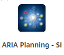

#### Go to Brachytherapy planning

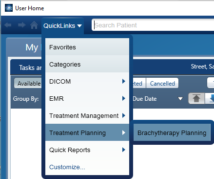

#### Find your patient

#### Start Plan

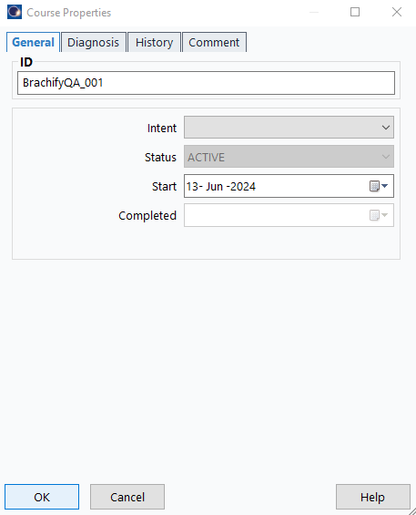

These values are for demostration purposes only

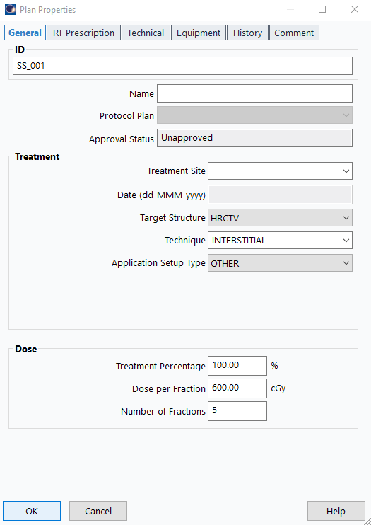

#### Line up Cylinder and place Central Axis
##### The Cenral Axis will be used in order to orientate all of the other needles in Brachify so place it as acuratly as possible

It is Important that you label your central axis channel central axis

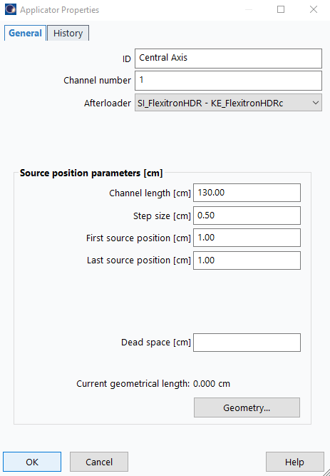

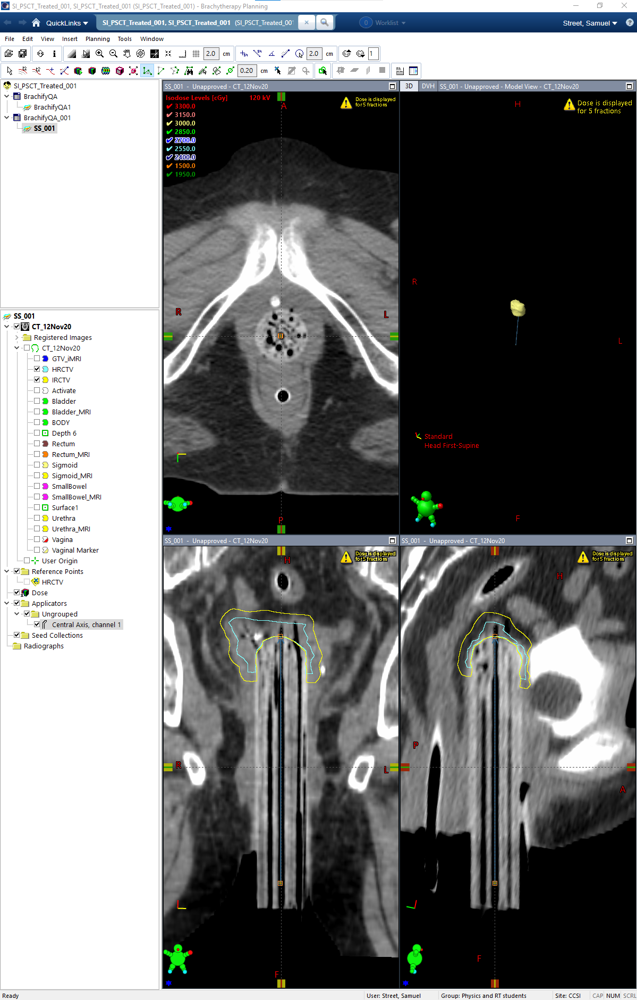

#### Places the other needles in your plan ensuring none of the needles intersect
##### Save your file

#### Export your file

##### Click the overide button

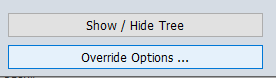

##### Grab the Planning Structure set and set Dose to None

##### Only need the Sructure set in order to use Brachify

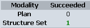

##### Place file in your favorite folder

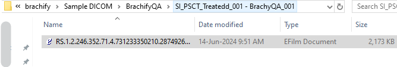

## Using Brachify

### Opening Brachify for the First Time 
##### Go into the folder where you downloaded Brachify

##### There will be 2 files one will be an .exe file

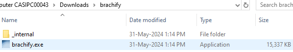

(If you would like a Desktop Shortcut follow text to the right, if not skip text on the right)

Right click on the exe file select Create shortcut 

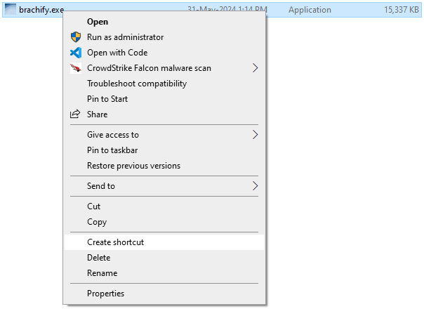

Drag the .exe - Shortcut file to the location on your descktop where you would like it

##### Now double click on the .exe file, either the shortcut or the previously existing exe file

 

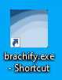 

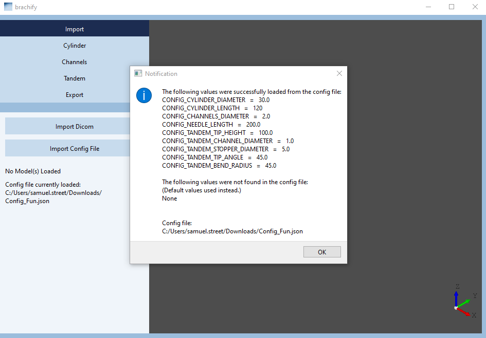

