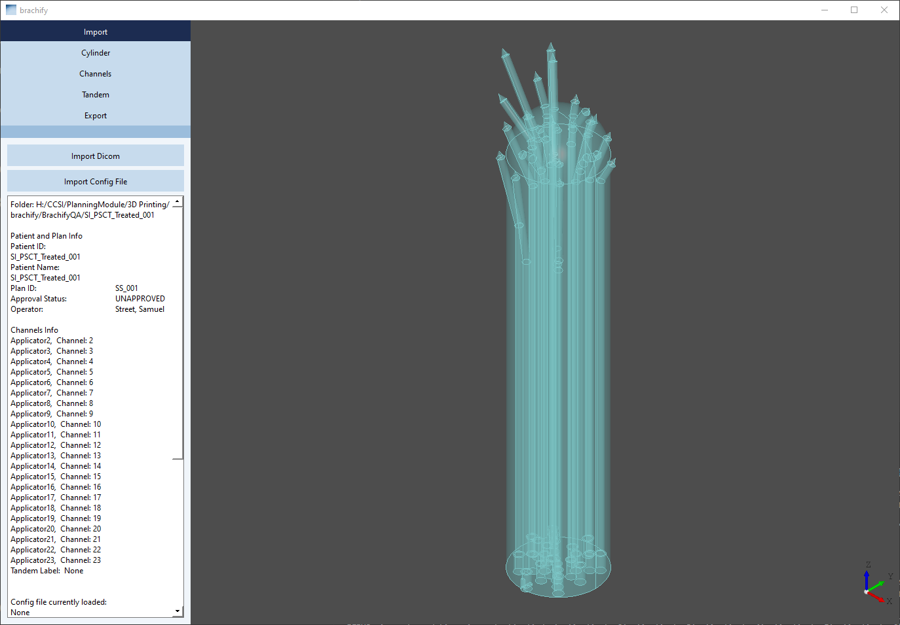
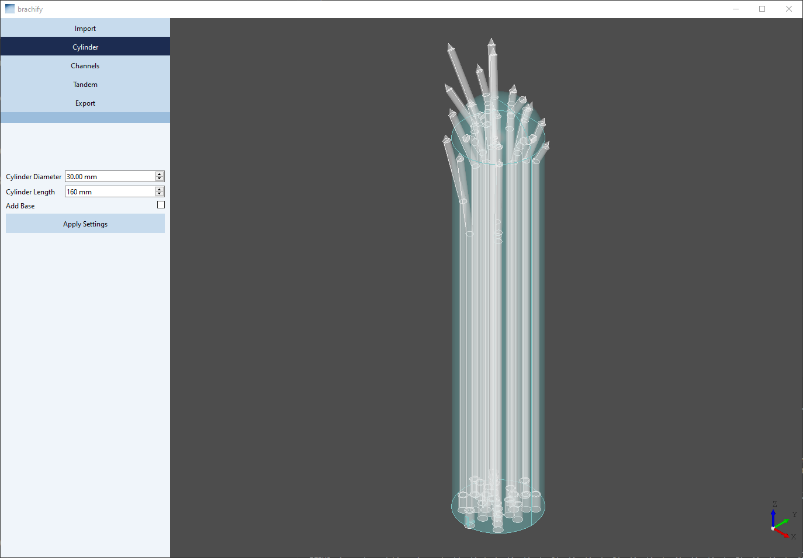
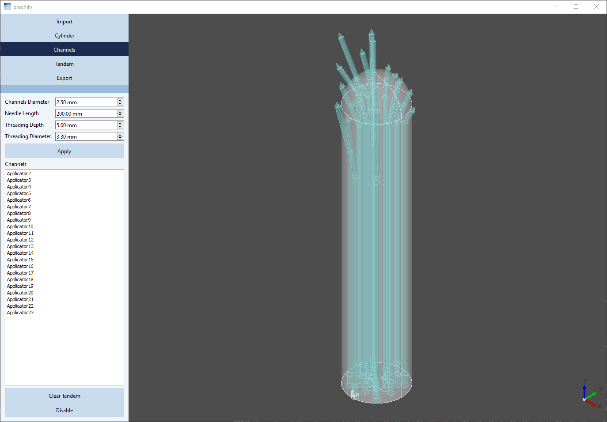
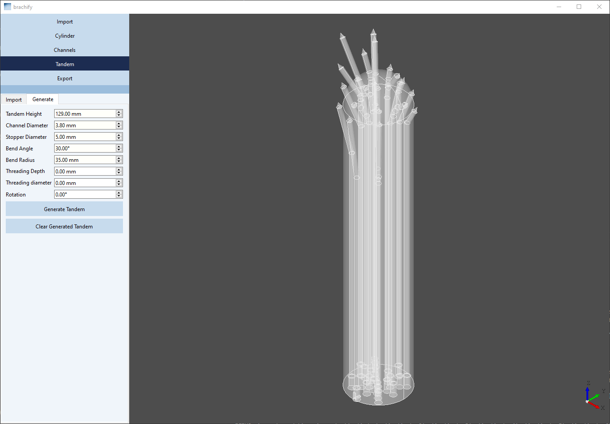
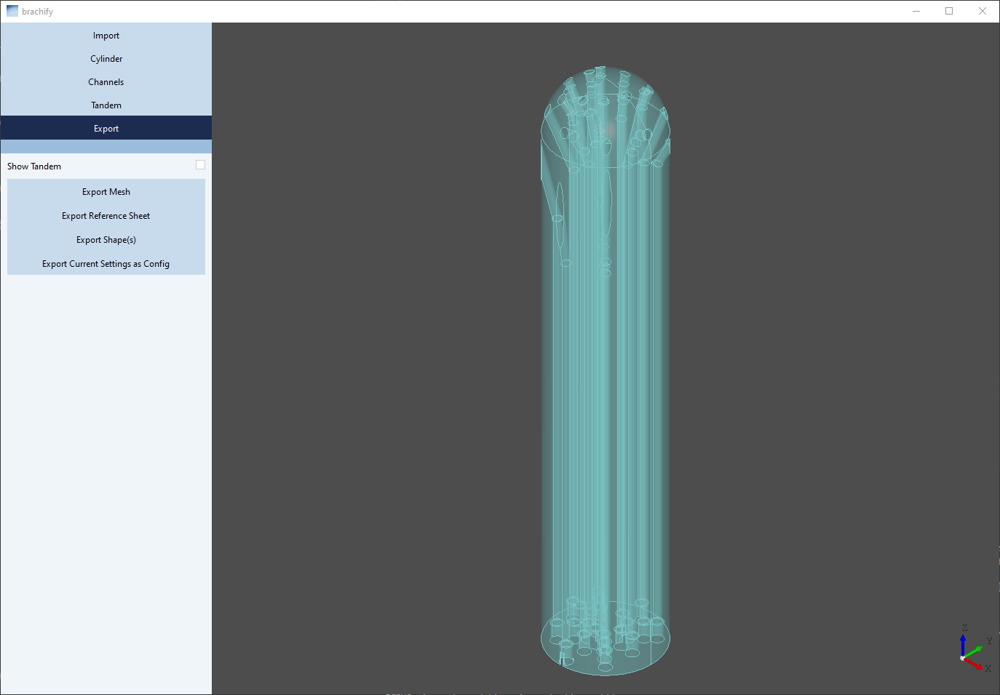

# *brachify*

Thank you for checking out *brachify* - a software designed by Michael Kudla, Ph.D. ( Contact: michael.kudla AT bccancer.bc.ca ) for generating 3D printable cyliders for interstitial GYN brachytherapy!

## License
*brachify* is licensed under the terms of the GNU 3.0 license, as noted in the LICENSE file. 

## User Info
### Download exe zip at:
https://github.com/brachify/brachify/releases

### Tutorial:
Please read the full user manual found at:
[`user_guide/Brachify User Manual.docx`](user_guide/Brachify%20User%20Manual.docx)

Generating your first cylinders: 
1) Download the most recent *brachify* release from the [`release page`](https://github.com/brachify/brachify/releases).

2) Extract the folder from the zip file you downloaded and inside of the folder created select the 'brachify.exe' file.

3) Press the Import Dicom button and navigate to find the folder you would like to import.
   The folder should contain: <br>
        1 DICOM RTPlan file you would like to use (exported from your TPS) AND <br>
        1 DICOM RTSTRUCT file associated with your RTPLAN file.

   Note: Ensure your DICOM plan/structure set files have the associated structure set in the same folder and a straight channel labeled 'Central Axis' with the tip of the needle just touching the top of the cylinder and the bottom in line with the center of your cylinder -- this channel will be used to determine the cylinder central axis and tip direction. It must be named "Central Axis".

5) Press 'Export Mesh' in order to get your .stl file and 'Export Refrence Sheet' in order to get a reference sheet for your cylinder.

6) Navigate through the Cylinder, Channels, or Tandem tabs to modify your model as needed.

Import Tab<br>
<br>
Cylinder Tab<br>
<br>
Channels Tab<br>
<br>
Tandem Tab<br>
<br>
Export Tab (final model preview) <br>
<br>
Example Reference Sheet <br>
<br>

## Developer Info
### Getting Started programatically
- Download Python 3.12 (or 3.11)
- Download Visual Studio Code (VS Code)
- download git
- create a conda environment using the instructions in [`virtual_environments_instructions.md`](virtual_environments_instructions.md)
- download code (clone git repository to your local machiene)
- run `launch.py` to use the application
- developer notes can be found in the folder [`notes/`](notes/)

### To build .exe
#### Option 1
Make sure your working directory is the brachify directory then run the following command in the command line:  

```pyinstaller --noconsole --noconfirm --icon "./resources/brachify_splash-ico.ico" --name "brachify" --splash ".\src\windows\splashscreen\brachify_splash.png" --hidden-import "pydicom.encoders.gdcm" --hidden-import "OCC" --hidden-import "pydicom.encoders.pylibjpeg" --paths=src "./src/launch.py" --exclude-module PyQt5```  

After it has compiled it will make two folders in your brachify folder: `dist` and `build`. The executable is `brachify.exe` located in `dist\brachify`.

#### Option 2
Run [`build_executable.py`](build_executable.py). This should produce the same result as [Option 1](#option-1).

After it has compiled it will make two folders in your brachify folder: `dist` and `build`. The executable is `brachify.exe` located in `dist\brachify`.

