# How to use Brachify

## Varian

### Make you model
### Open Citrix portal

#### Go to Brachytherapy planning

#### Find your patient

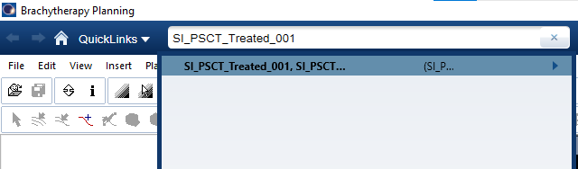

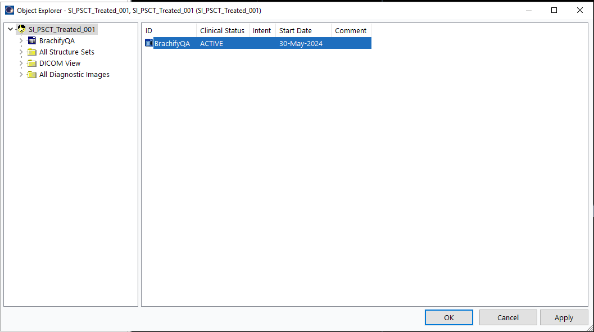

#### Start Plan

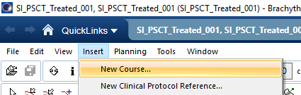

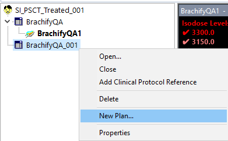

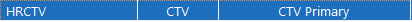

###### These values are for demostration purposes only

#### Line up Cylinder and place Central Axis
###### (The Cenral Axis will be used in order to orientate all of the other needles in Brachify so place it as acuratly as possible)

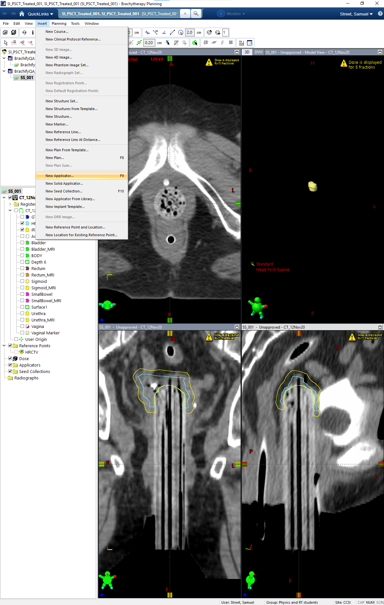

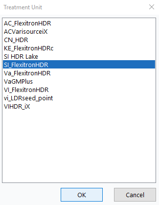

###### (It is Important that you label your central axis channel central axis)

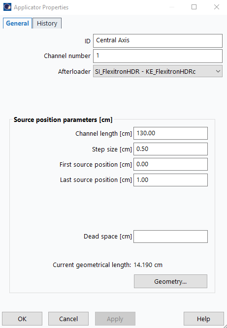

#### Places the other needles in your plan ensuring none of the needles intersect
#### Save your file

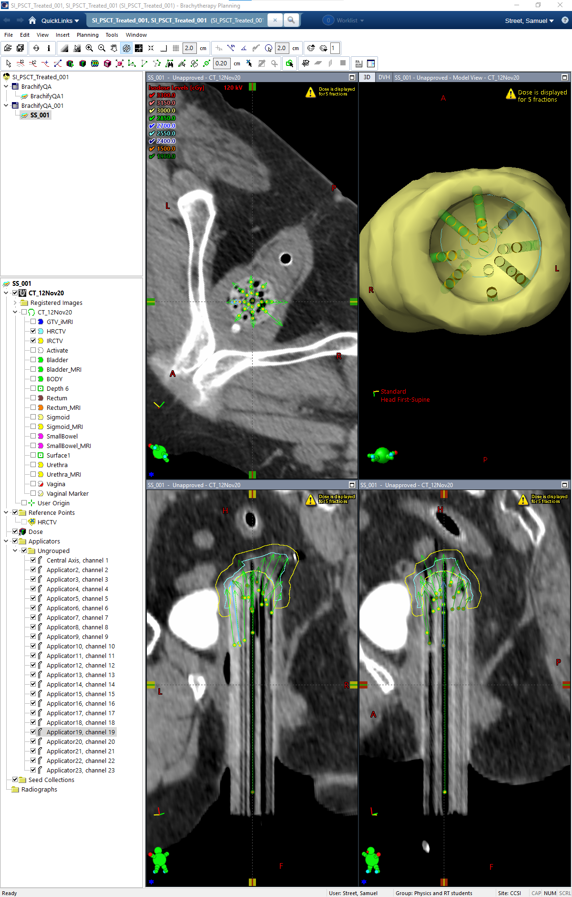

#### Export your file

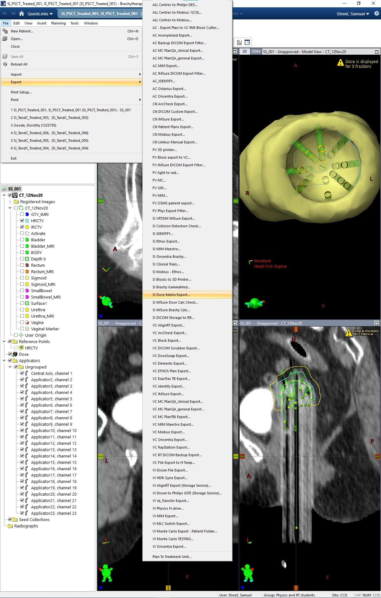

#### Click the overide button

#### Grab the Planning Structure set and set Dose to None

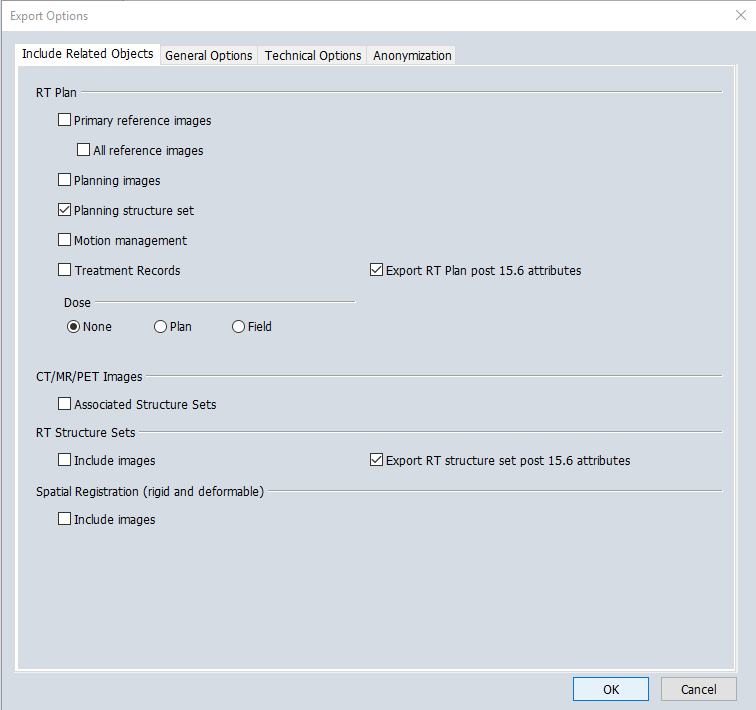

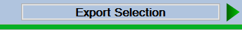

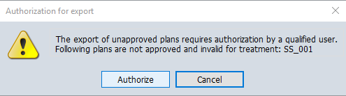

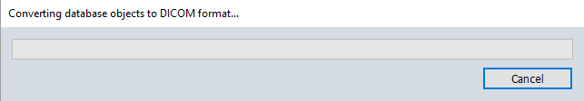

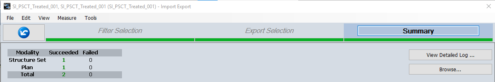

#### Place file in your favorite folder

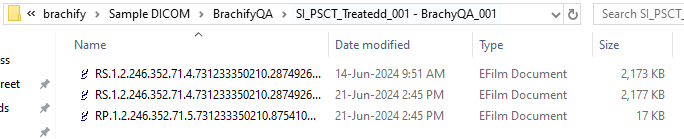

## Setting up Brachify

### Opening Brachify for the First Time 
#### Go into the folder where you downloaded Brachify

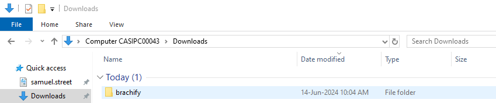

#### There will be 2 files one will be an .exe file

  <h5>(If you would like a Desktop Shortcut follow text to the right, if not skip text on the right) </h5>

  <h5>Right click on the exe file select Create shortcut </h5>

  <h5>Drag the .exe - Shortcut file to the location on your descktop where you would like it</h5>

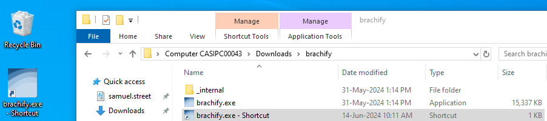

  <h5>Now double click on the .exe file, either the shortcut or the previously existing exe file</h5>

 

 

  <h2>Using Brachify</h2>

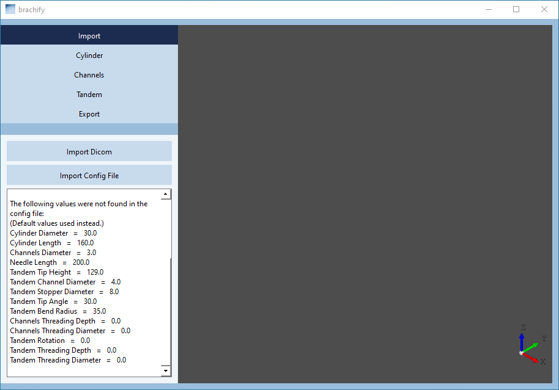

  <h4>You will imidiatly an information pannel below the Import Config File and Import Dicom buttons which displays all of the configuration settings that have been loaded from default</h4>
  <h4>Press the Import Dicom Button</h4>

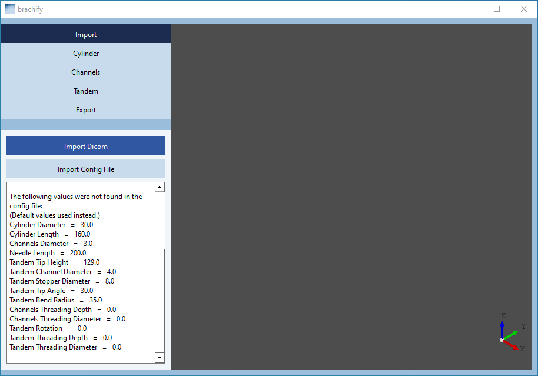

  <h4>Select the folder your DICOM files are saved to and press select folder</h4>

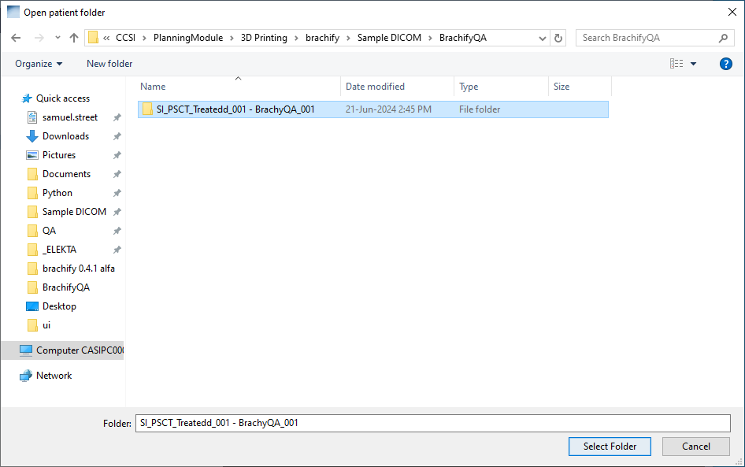

  <h4>By default after importing a file you are imediatly brought to the export view where you can export the cylinder for your plan were there are several options to export your design; however, for the purposes of this tutorial press the Import button to go back tot he import screen (More information on the Export Screen is availible near the end of this tutorial)
</h4>

<h3>Import</h3>

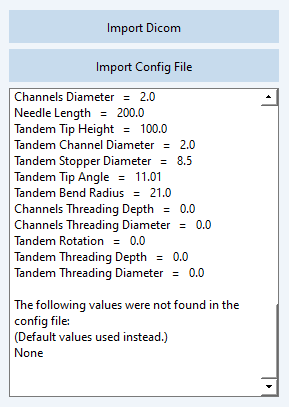

  <h4>You will see there is now more information inside of the info box and will find the the information in the Import tab and info box layed out as follows
  
  <ul>Import Layout
      <li>Import Dicom: 
          <ul>
              <li>As descovered above this button allows you to import a dicom file</li>
          </ul>
        </li>
      <li>Import Config File:
          <ul>
              <li>Allows you to import a confguration file which will contain values you can use by default instead of the current default values, a little more information on the config file can be found in the export tab explination at the end of this tutorial</li>
          </ul>
      </li>
      <li>Information Pannel:
          <ul>
              <li>Filepath of most recently used DICOM folder</li>
              <li>Patient Info</li>
              <li>Channel Info: This will diplay channels as Channel_Label, Channel: (Channel #)</li>
              <li>Config file location</li>
              <li>Overview of values loaded into brachify from config file or default</li>
          </ul>
      </li>
</ul>
</h4>

<h3>Display</h3>

  <h4>  To the right of every section there will be a display pannel that shows you what your cylinder should look like
  
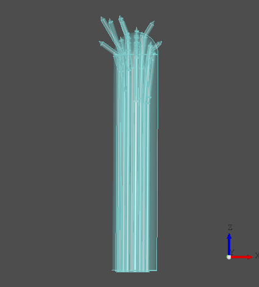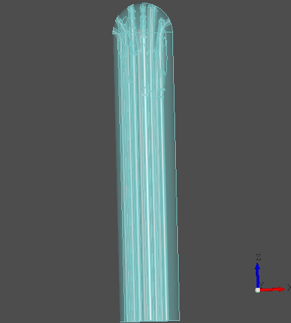

    <ul>
      <li>In the Import, Cylinder, Channel, and Tandem tabs the cylinder will apear with the channels an if applicable tandem cutout not yet cut out. It is important to visually verify that all of your channels look as they should and that there is no blockages in the design</li>
      <li>In the Export tab the display will look as the image on the right with all the channels and if applicable tandem cutout removed from the deign. This is the model which will actually be saved when you export your design so it is important to ensure that all of the channels look as they should and there are no blockages</li>
      <li>The scroll wheel on your mouse in order to zoom in and out of areas of interest on your model</li>
      <li>Right click and hold while dragging around your mouse in order to rotate the design</li>
      <li>If on the "Channels" tab then you may also left click on channels in order to highlight them and check their channel lables via the info pannel in the channels section - see "Channels" for more information</li>
    </ul>
</h4>

  <h4>Now click on the Cylinder tab
</h4>

<h3>Cylinder</h3>

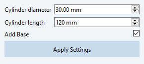

<h4>
<ul> Cylinder Layout
    <li>Cylinder Diameter:
      <ul>
          <li>Changes the diameter of the cylinder to what you need</li>
      </ul>
    </li>
    <li>Cylinder Length: 
      <ul>
          <li>Change the length of the cylinder to what you need</li>
      </ul>
    </li>
    <li>Add Base: 
      <ul>
          <li>Adds a base to the design as depicted below</li>
      </ul>
    </li>
    
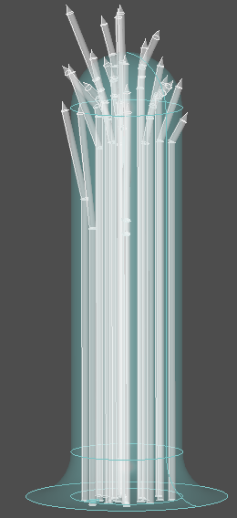 

    <li>Apply Settings: 
      <ul>
          <li>Applies your settings</li>
          <li>WARNING you must press this button in order for your values to be saved</li>
      </ul>
    </li>
</ul>
</h4>

  <h4> Now click on the Channels tab
</h4>

<h3>Channels</h3>

<h4>
  It is important to note that every time you change values in the channels tab and press apply you should re-inspect you channels and make sure they have changes to the correct values. If you do happen to spot an error in one of you channels try adjusting the channel radius or one of the other values slightly in order to correct the issue. If the issue persister please contact ______________________________________________________ and describe your issue and it will be dealt with as soon as is possible 
  <ul> Channels Layout
      <li>Channel Diameter:
        <ul>
          <li>The value for the diameter of every needle channel excluding the tandem</li>
        </ul>
      </li>
      <li>Needle Length:
        <ul>
          <li>The length of the needles being used (this value will not be depicted on the example needles in the viewer to right hand side of the screen, this value is only used as a reference for the refference sheet you are able to print on the export tab)</li>
        </ul>
      </li>
      <li>Threading Depth:
        <ul>
          <li>If you would like to add threading to the end of a needle set this value to set the depth of the threading</li>
        </ul>
      </li>
      <li>Threading Diameter: 
        <ul>
          <li>If you would like to add threading to the end of a needle set this value to set the diameter of the cylinder that should be added to the end of the needle channel</li>
        </ul>
      </li>
      <li>Channel List: 
        <ul>
          <li>You can select channels and the selected channel will change color in the model so that you can inspect the channel</li>
          <li>You can select channels and the selected channel will change color in the model so that you can inspect the channel</li>
        </ul>
      </li>
      
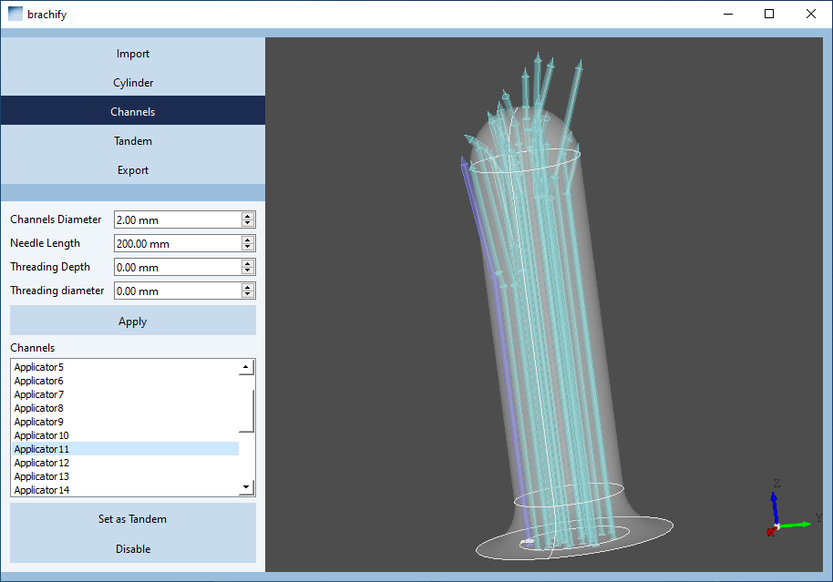 

      <li>Set as Tandem: 
        <ul>
          <li>Will take the needle out of the 3D model (but not out of the list so this acion can be undone) and then will set your tandem angle to be the same as the angle of the needle currently selected - see the Tandem section for more information</li>
        </ul>
      </li>
      <li>Disable/Enable: 
        <ul>
          <li>Will disable or enable a needle channel that you want removed or placed back into the plan, for instance if you find one needle to be uneccessary you may remove it from the cylinder here</li>
          <li>If applicable you can also add the needle channel selected as the tandem back into the model</li>
        </ul> 
      </li>
  </ul>
</h4>

  <h4> Now click on the Tandem tab
</h4>

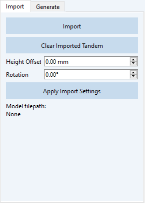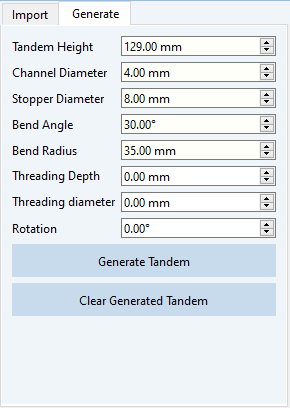

  <h4> The tandem tab is broken up into 2 tabs the Import and Generate tab. The Import tab is for Importing a premade tandem, while the Generate tab is for making a new tandem cut out from within Brachify. The tabs are layed out as follows
</h4>

  <h4>
<ul> Tandem
    <li>Import
        <ul>
            <li>Import
              <ul>
                <li>Pressing this button will take you to the file explorer where you can select a premade tandem</li>
                <li>NOTE 1: premade tandems must be imported as an STEP file and no change will be made to an imorted file other than rotation and height adjustment</li>
                <li>Note 2: Tandems will always be loaded in at the coordinate (0,0,0) so ensure that when you are 3D-designing your tandem you design the base to be centered at (0,0,0)</li>
              </ul>
            </li>
            <li>Clear Imported Tandem
              <ul>
                <li>This button will clear any loaded tandem (it will also clear a generated tandem)</li>
              </ul>
            </li>
            <li>Height Offset
              <ul>
                <li>This will change the height of an imported tandem so that if the height it was designed at is a little off you can adjust in it in Brachify</li>
              </ul>
            </li>
            <li>Rotation
              <ul>
                <li>This will allow you to choose the rotation of any imported tandem</li>
              </ul>
            </li>
            <li>Apply Import Settings button
              <ul>
                <li>This button must be pressed in order to save any of the changes that you have made to your imported tandem</li>
              </ul>
            </li>
            <li>Filepath of imported tandem
              <ul>
                <li>"This will be displayed just below the Apply Imported Settings button"</li>
              </ul>
            </li>
        </ul>
    </li>
    <li>Generate
        <ul>
            <li>Tandem Height
              <ul>
                <li>Changes the height of where the base of the tandem will start</li>
              </ul>
            </li>
            <li>Channel Diameter:
              <ul>
                <li>Changes the diameter of the tandems channel</li>
              </ul>
            </li>
            <li>Stopper Diameter
              <ul>
                <li>Changes the diameter of the stopper on the tandem</li>
              </ul>
            </li>
            <li>Bend Angle
              <ul>
                <li>The angle at which the tandem will be bent</li>
              </ul>
            </li>
            <li>Bend Radius
              <ul>
                <li>The radius of the cirlce used to construct the tandem (see diagram at end of section)</li>
              </ul>
            </li>
            <li>Threading Depth
              <ul>
                <li>If you would like your tandem to have threading, specify the depth here</li>
              </ul>
            </li>
            <li>Threading Diameter
              <ul>
                <li>If you would like you tandem to have threading specify the diameter of the cylinder neccessary here</li>
              </ul>
            </li>
            <li>Rotation
              <ul>
                <li>Indicate the angle at which you would like your tandem to be pointing in the (x,y) axis. 0°will construct a tandem that is pointing directly into the x direction.</li>
              </ul>
            </li>
            <li>Generate Tandem
              <ul>
                <li>After you have all of the parameters the way you would like them press this button in order to generate your tandem</li>
                <li>WARNING pressing this button will remove any tandem which was previously placed</li>
              </ul>
            </li>
            <li>Clear Generated Tandem
              <ul>
                <li>This button will clear any tandem that is currently being displayed from the screen</li>
              </ul>
            </li>
        </ul>
    </li>
</ul>

Now click the "Export" tab
</h4>

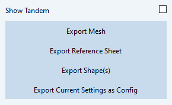

  <h4>
  <ul> <h3>Export</h3>
      <li>Show Tandem checkmark box
        <ul>
          <li>This feature will allow you to viualise what a tandem would like like if placed in your cylinder model after all of the channels are removed and the cutout for the tandem is also taken out</li>
          
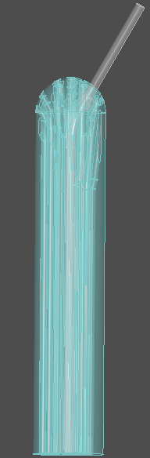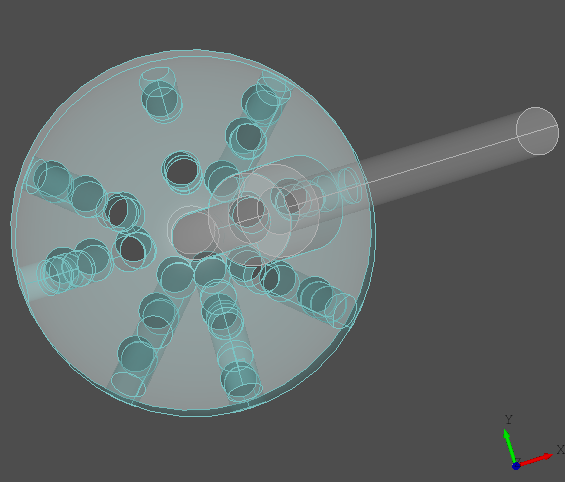

        </ul>
      </li>
      <li>Export Mesh
        <ul>
          <li>Pressing this button will allow you to save your cylinder as a 3D-printable STL file</li>
        </ul>
      </li>
      <li>Export Refference Sheet
        <ul>
          <li>Pressing this button will allow you to save a refference sheet containing information about your cylinder model</li>
        </ul>
      </li>
      <li>Export Shape(s)
        <ul>
          <li>Pressing this button will allow you to export your 3D cylinder as a shape file if you wish to do additional work in solid works or some other 3d designing softwear the accepts shape files</li>
        </ul>
      </li>
      <li>Export Current Settings as Config
        <ul>
          <li>This will allow you to export the current settings to be loaded in by default the next time you use Brachify</li>
        </ul>
      </li>
  </ul>
</h4>

<h2>Layout of Brachify</h2>
<h6>(here is an overview of the layout of Brachify)</h6>

  <h4> 
    <ul>
        <li>Import
            <ul>
                <li>Import Dicom</li>
                <li>Import Config File</li>
                <li>Information Pannel
                    <ul>
                        <li>Filepath of most recently used DICOM folder</li>
                        <li>Patient Info</li>
                        <li>Channel Info</li>
                        <li>Config file location</li>
                        <li>Overview of values loaded into brachify from config file or default</li>
                    </ul>
                </li>
            </ul>
        </li>
        <li>Cylinder
            <ul>
                <li>Cylinder Diameter</li>
                <li>Cylinder Length</li>
                <li>Add Base</li>
            </ul>
        </li>
        <li>Channel
            <ul>
                <li>Channel Diameter</li>
                <li>Needle Length</li>
                <li>Threading Depth</li>
                <li>Threading Diameter</li>
                <li>Channel List</li>
                <li>Set as Tandem</li>
                <li>Ability to remove needles from plan</li>
            </ul>
        </li>
        <li>Tandem
            <ul>
                <li>Import
                    <ul>
                        <li>Import</li>
                        <li>Clear Imported Tandem</li>
                        <li>Height Offset</li>
                        <li>Rotation</li>
                        <li>Apply Import Settings button</li>
                        <li>Filepath of imported tandem</li>
                    </ul>
                </li>
                <li>Generate
                    <ul>
                        <li>Tandem Height</li>
                        <li>Channel Diameter (Tandem Channel Diameter)</li>
                        <li>Stopper Diameter</li>
                        <li>Bend Angle</li>
                        <li>Bend Radius</li>
                        <li>Threading Depth</li>
                        <li>Threading Diameter</li>
                        <li>Rotation</li>
                        <li>Generate Tandem</li>
                        <li>Clear Generated Tandem</li>
                    </ul>
                </li>
            </ul>
        </li>
        <li>Export
            <ul>
                <li>Show Tandem checkmark box</li>
                <li>Export Mesh</li>
                <li>Export Refference Sheet</li>
                <li>Export Shape(s)</li>
                <li>Export Current Settings as Config</li>
            </ul>
        </li>
    </ul>
  
  - Export Mesh: Will export the cylinder for your plan as an STL file
  - Export Reference Sheet: Will export a reference sheet which has some of the information about your plan
  - Export Shape(s): Will export your current setting as a new configuration file which can be used instead of the values that are used by default </h2>

